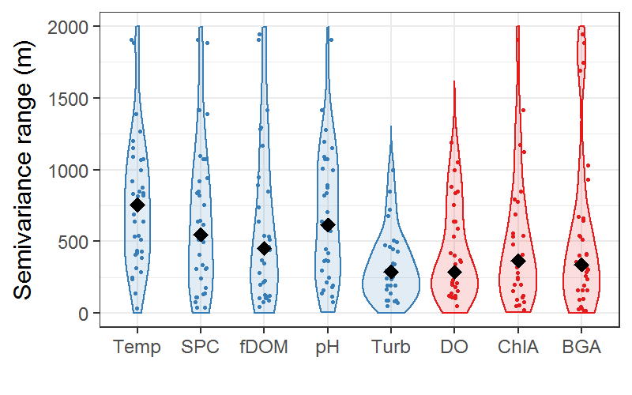

```{r setup, include=FALSE}
# Load options
  knitr::opts_chunk$set(fig.path='Figs/',echo = TRUE)
```

```{r, include=FALSE}

#Load data and libraries
#Data wrangling libraries
library(plyr)
library(tidyr)
library(dplyr)

#Spatial libraries
library(sp)
library(raster,verbose = F)
library(rgdal, verbose=F)
library(gstat)
library(rgeos)
library(spdep)
library(geoR)
library(prettymapr)

#Other libraries
library(SDMTools)
library(RColorBrewer)
library(viridis)


library(FedData)

#Load data

#Mendota
MEoutline <- readOGR('../../Zoo955/Data/Shapefiles/Mendota_shape.shp', layer='Mendota_shape',stringsAsFactors = F)

#Lakes in northern WI
mylakes<-readOGR("../Data/GISData", "regional_lakes_6", verbose=F)
mylakes<-spTransform(mylakes,  CRS("+proj=utm +zone=15 ellps=WGS84"))

#nhld polygon
nhld<-readOGR("../Data/GISData", "nhld_boundary", verbose=F)
nhld<-spTransform(nhld,  crs(mylakes))

#State outlines
states<-readOGR("../Data/GISData", "StateOutlines", verbose=F)
states<-spTransform(states,  crs(mylakes))
WI<-states[states$NAME=='Wisconsin',]
MI<-states[states$NAME=='Michigan',]

#Subset UP from Lake Michigan polygon
UP_Poly<-MI@polygons[[1]]@Polygons[[6]]
UP_Poly2<-Polygons(list(UP_Poly), "s1")
UP<-SpatialPolygons(list(UP_Poly2), proj4string=crs(MI))

LSG<-readOGR("../Data/GISData", "LittleStGermainLake2015-07-15cleaned", verbose=F)
LSG<-spTransform(LSG, crs(mylakes))

lake_polygon<-mylakes[mylakes$Lake_Name=='Little St Germain Lake', ]

```

## What do I do? 

* Characterize within lake patterns of water chemistry
* Interpolate to generate spatially weighted distributions of water chemistry 
* Automate these steps across multiple lakes and through time


## Code reflects my progression performing spatial analyses in R 
* Old code was long scripts, loops, copy/paste
* New code using functions/apply statements, but I have yet to go back and tidy old code. 


## Data example

* Methane measurements while boating around Little Satin Germain Lake.
* ~10,000 point observations distributed in grid like transects
* We can interpolate across the lake surface and estimate CH4 flux to the atmosphere for the entire lake? 
* We also ask questions about the drivers and consequences of spatial heterogeneity within lakes


```{r, fig5, fig.height=5, fig.width=6, fig.align='center', echo=F}

xdist <- diff(bbox(lake_polygon)[1,1:2])
scale <- signif(xdist/10, digits=1)

polyx<-c(bbox(lake_polygon)[1,2]-scale*(c(0.2,1.2)))
polyy<-c(bbox(lake_polygon)[2,1]+scale*c(.2,.4))
coords<-data.frame(x=c(rep(polyx[1], 2), rep(polyx[2], 2)), y=c(rev(polyy), polyy))
poly_line<-Line((coords))
S1 = Lines(list(poly_line), ID="a")
poly_line_sp<- SpatialLines(list(S1))
          
l1 = list(lake_polygon, col=1, fill=0, lwd=3, lty=1, first=F)
l2 = list("SpatialPolygonsRescale", layout.north.arrow(type=1), offset = 
                      c(bbox(lake_polygon)[1,1]+.25*scale, bbox(lake_polygon)[2,2]-1.1*scale),
                      scale = scale*1, first=FALSE) 
l3<- list(poly_line_sp, fill=NA, lwd=2, lty=1, first=F)

l4 = list("sp.text", c(mean(polyx), polyy[1]),
                    paste0(scale, "m"), cex=0.6, first=FALSE, pos=3) 
          
print(spplot(LSG[50], colorkey=TRUE, cuts=99, sp.layout=list(l1, l2, l3, l4) , main="Measured CH4 (uM) in Little St Germain Lake", xlim=bbox(lake_polygon)[1,], ylim=bbox(lake_polygon)[2,]))

```

```{r, fig6, fig.height=5, fig.width=6, fig.align='center', echo=F}

#Dimensions of lake outline
brdydim<-lake_polygon@bbox

# Create a grid of points within this boundary.
# Grid is where you will predict values
data1.grid<-polygrid(seq(brdydim[1,1], brdydim[1,2], 100), seq(brdydim[2,1], brdydim[2,2], 100), borders=lake_polygon@polygons[[1]]@Polygons[[1]]@coords)

# Set names of coordinates and match projection
coordinates(data1.grid)<-~x+y
proj4string(data1.grid) <- crs(mylakes)
# Convert to gridded (pixels) rather than points
gridded(data1.grid) <- TRUE

LSG2<-LSG[is.na(LSG@data[,50])==FALSE,]

predict <- gstat::idw(LSG2@data[,50]~1, LSG2, data1.grid, idp=2)

print(spplot(predict, zcol='var1.pred', colorkey=TRUE, cuts=99, sp.layout=list(l1, l2, l3, l4) , main="Predicted CH4 (uM)", xlim=bbox(lake_polygon)[1,], ylim=bbox(lake_polygon)[2,]))

```

Convert Concentration to flux using a model of gas transfer velocity

```{r, fig7, fig.height=5, fig.width=6, fig.align='center', echo=F}

predict$Flux <- predict$var1.pred*rnorm(length(predict$var1.pred), 9, .1)*24/100

print(spplot(predict, zcol='Flux', colorkey=TRUE, cuts=99, sp.layout=list(l1, l2, l3, l4) , main="Predicted CH4 flux (mmol/m2/hr)", xlim=bbox(lake_polygon)[1,], ylim=bbox(lake_polygon)[2,]))

```


```{r, fig8, fig.height=3, fig.width=6.5, fig.align='center', echo=F}

par(mfrow=c(1,2), oma=c(0,2,0,0), mar=c(3,1,0.5,0.5), mgp=c(2,.5,0))

hist(predict$var1.pred, ylab='Number of pixels', xlab=expression(paste(CH[4], ' concentration (', mu, 'M)')), main='', col='lightgrey')

hist(predict$Flux, ylab='', xlab=expression(paste(CH[4], ' efflux (mmol m'^'-2', ' d'^'-1', ')')), main='', col='lightgrey')

        
```

Clearly spatial patterns exist for methane concentration/flux. Estimates from a single location do not represent the entire lake surface. 


## General questions to my research

* How variable are individual lakes?

* How does variability vary among variables? (Temperature vs dissolved oxygen)

* How does variability vary among lakes? (Big lakes vs small lakes)

* What are the dominant scales of variation? (small patches vs large patches)


## Example 2 - Within lake spatial variability among lakes

* Sampled 40 lakes in Northern Wisconsin across lake productivity, size, and morphometry gradients


```{r, fig9, fig.height=5, fig.width=6, fig.align='center', echo=F}

# lakecolor<-'lightblue'
# 
# plot(nhld, col=NA, border='black', lwd=4)
# plot(WI, add=T, lwd=2, lty=3)
# # plot(nlcd_masked, add=T)
# plot(mylakes, add=T, col=lakecolor, border='black', lwd=1)
# 
# addnortharrow(pos='bottomleft', padin=c(1.2,.5), scale=.6)
# addscalebar(plotunit = 'm', widthhint=.2, htin=0.1, pos='bottomleft', padin=c(1.1,.15), style='ticks')
# 
# legend('bottomleft', inset=0.01, ncol=1, c('My Lakes', 'NHLD'), col=c('black'), pt.bg = c(lakecolor, 'white'), cex=0.8, lwd=c(1,3), lty=NA, pt.cex=2, pch=c(22), y.intersp=1.2, bty='n')
# 
# 
# legend('topleft', inset=-.01, ncol=2, c("Wisconsin"), bty='n', cex=0.8, x.intersp=0)
# legend('topright', inset=-.01, ncol=2, c("Michigan"), bty='n', cex=0.8, x.intersp=0)
# 
# # Add inset map of WI and MI-upper
# usr<-par('usr')
# xdiff<-diff(usr[1:2])
# ydiff<-diff(usr[3:4])
# scaler=12
# xshift<-(-1280000)
# yshift<-(720000)
# 
# par(usr=c(xshift+usr[1]-xdiff*scaler, xshift+usr[2]+xdiff*scaler, yshift+usr[3]-ydiff*scaler,yshift+usr[4]+ydiff*scaler))
# 
# plot(WI, add=T,  col='lightgrey')
# plot(UP, add=T,  col='lightgrey')
# plot(nhld, add=T, border='black', lwd=3)
# 
# box(which='plot')

```

* For each lake, statistics describing spatial heterogeneity were calculated for all measurements (Temperature, dissolved oxygen, etc.)
    + standard deviation
    + quartile dispersion
    + coefficient of variation
    + skewness
  
* We also evaluated spatial structure using semivariance and correlogram models
    + semivariance range
    + correlation at distance intervals

Semivariance models for 3 variables

{width=30%} {width=30%}  {width=30%}

Semivariance range is the distance at which observations are no longer spatially autocorrelated.

In this example, temperature (left panel) has a greater semivariance range (~1000 m), while fDOM (middle) and chlorophyll (right) have shorter ranges (~250 m). In this example, we can say that the dominant scale of variation for temperature occurs at a broader scale than the other variables. 

{width=30%} {width=30%} {width=30%}

Looking at the maps, we see finer patches for fDOM and chlorophyll than temperature


## Semivariance modelling in R

* Uses the functions `variogram()`, `vgm()`, `fit.variogram()` in the `gstat` package

```{r, fig10, fig.width = 3, fig.align='center', fig.height=3}

library(gstat)

#Parameters for semivariogram calculation. Maximum distance (cutoff) and bin size (width)
cutoff=3000
width=50

# CH4 data are the 50th column in spatial points data frame 'LSG2'

# Calculate variogram
v = variogram(LSG2@data[,50]~1, LSG2, cutoff=cutoff, width=width)
plot(v)

```

* Now we need to fit a model
* What kind of model should we use?

```{r, fig11, fig.height=5, fig.width=7, fig.align='center', echo=T}

#Look at a few types of semivariogram models
show.vgms(sill=5, range=0.75, ylim=c(0,6), xlim=c(0,2.5), models=as.character(vgm()$short[c(1:10)]))
```

* Based on the variogram of the data, many choices are appropriate. 

* Note that these models all have the same sill and range parameter, but show different plateau distances. In all of these models the `range==1`, however only in the Spherical and circular models does this equate to the distance at which the sill is reached. Other models (Exponential, Gaussian, etc.) continue increasing beyond this distance. Therefore be careful in interpreting the 'range' attribute that these models produce. 

```{r, fig12, fig.width = 3, fig.height=3, fig.align='center'}
models<-c('Nug', 'Lin', 'Sph', 'Gau')

# Guess sill, range, and nugget
# These help the fit.variogram function figure out the best model
est_sill<-median(v$gamma)
est_range<-cutoff/4
est_nugget<-v$gamma[1]

#fit model to variogram
#fit.method=2 weights closer observations more than distant ones.
v.fit <- fit.variogram(v, vgm(est_sill=est_sill, models, est_range=est_range, nugget=est_nugget), fit.method = 2)

# Look at model fit
plot(v, v.fit)
v.fit

#output semivariogram parameters
SemiRange <- v.fit$range[2]
SemiSill <- v.fit$psill[2]

```
Looks like a spherical model was selected, which does a pretty good of fitting data.
`fit.variogram` uses a weighted sum of squared errors for fitting models
You can adjust the weighting using the `fit.method` attribute in the `vgm` function


Or do this with a function and extract for multiple variables, days, and lakes

```{r}

# Function to fit variograms and extract range/model/sill
ExtractRangeSill <-function (SPdf, colname, models, plot, ...){
  
  #Subset data to remove NAs
  SPdf2<-SPdf[is.na(SPdf@data[,colname])==FALSE,]

  #Create variogram and estimate model parameters
  v <- variogram(SPdf2@data[,colname]~1, SPdf2, ...)
  est_sill<-median(v$gamma)
  est_range<-max(v$dist)/4
  est_nugget<-v$gamma[1]
  
  #Fit variogram model to variogram
  v.fit<-fit.variogram(v, vgm(est_sill=est_sill, models, est_range=est_range, nugget=est_nugget), ...)
  
  #output model type, sill, and range
  output<- data.frame(model=as.character(v.fit$model[nrow(v.fit)]), sill=v.fit$psill[nrow(v.fit)], range=v.fit$range[nrow(v.fit)])
  
  #Optional plotting
  if (missing(plot)){
  } else if (plot==T){
    print(plot(v, v.fit)) 
  } else {
  }
  
  return(output)
  
}

#Let's try it for one variable
head(LSG) #LSG is the spatialpointsdataframe
models<-c("Nug", "Lin", "Sph") #Which models to try?

table<-ExtractRangeSill(LSG2, colname='CH4uM_t', models=models, plot=T)
print(table)
```

Now let's apply it to multiple columns (variables) in one dataset

```{r}
columns<-c('TempC_t', 'fDOMQSU_t', 'CH4uM_t', 'CO2uM_t', 'ChlARFU_t')

SemiVarList<-lapply(columns, function (x) ExtractRangeSill(SPdf=LSG2, colname=x, models=models, plot=F))

#Clean up output table
SemiVarTable<-ldply(SemiVarList, data.frame)
SemiVarTable$variable <- columns
SemiVarTable<-SemiVarTable[c('variable', 'model', 'sill', 'range')]
print(SemiVarTable)

```

# Why is this useful?

Looking across lakes in northern Wisconsin, we see that variables differ in their spatial structure within lakes. 

{width=75%}

* Temperature tends to have the greatest semivariance ranges. Dissolved oxygen, chlorophyll, blue green algae, and turbidity have shorter ranges. 

* Thus spatial structure occurs at finer scales for biotic varibles than physics!

{width=75%}

* The same data as above, but ranges divided by lake size. A range ratio of 1 means the semivariance occured at the lake scale. Smaller ratios means the scale of variation occured at finer spatial scales 

* Most often temperature spatial patterns occur at the lake scale (ratio=1). 


